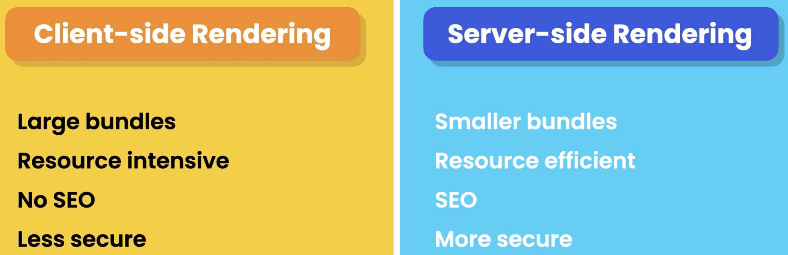
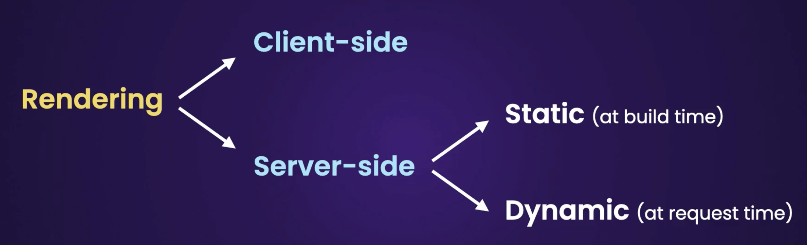
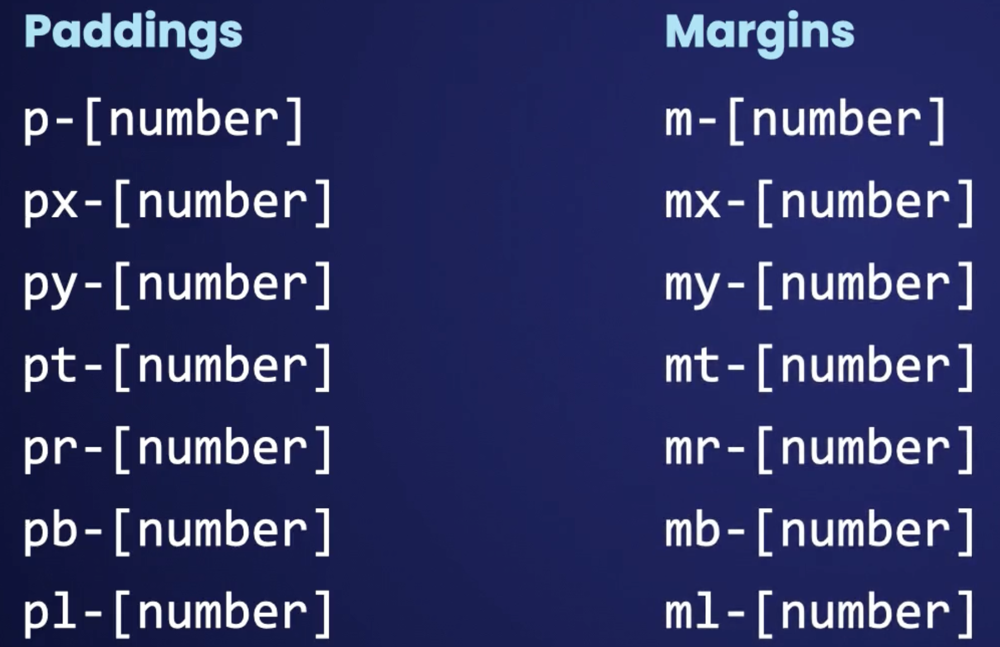
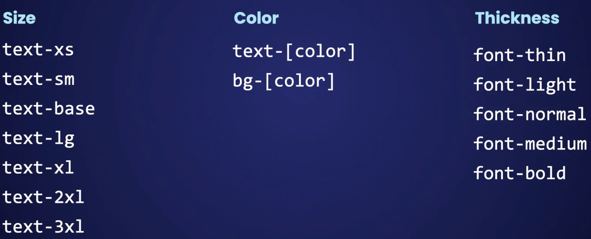

# Next JS

### Key Commands

- Creating a new project: `npx create-next-app`.
- Running the dev server: `npm run dev`.
- Building the application: `npm run build`.
- Starting the application in production mode: `npm start`.

### Project Structure

1. **app** folder - The **app** folder or the **"app router"** is the container of the routing system, in NextJS routing is based on the filesystem.
2. **public** folder - It contains all the public assets of our project lik media files, images etc.

### Fundamentals

3. Under the **app** folder we create all our routes by adding folders **_named same as our route names_** and within them a **"page".tsx/jsx** file. Naming the file **"page"** is important as it is part of the convention that NextJS uses.

4. To create a page for the **/users** route we can type the shortcut **"rafce"** which stands for **reactArrowFunctionExportComponent**. If we wish to any nested routes to the existing route, we simply add a new folder with the same name as the route and add a **"page"** file with all the component logic.

5. **Client-Side Navigation**: When adding a link to the **/users** page from the home page, using the anchor tag:

   ```tsx
   <a href="/users">Users</a>
   ```

   This triggers a **_full-page_** reload, causing the browser to reload **_all_** assets (e.g., fonts, HTML, CSS, JS and other assets) unnecessarily. Instead, we prefer client-side navigation to load only the page content while preserving shared assets like layouts and styles.

   > **FIX**: Instead, we use the **<Link\>** Component defined in NextJS, This enables **_Client-side Navigation_**, fetching only the assets of the /users page while preserving shared assets like layouts and styles.

6. **Rendering Techniques- CSR vs SSR**:
   

**Client-side Rendering (CSR)**: Rendering of pages occurs on the client-side using JavaScript. The HTML sent to the browser contains minimal content, and the rest is rendered dynamically in the user's browser after the JavaScript is executed.

**Server-Side Rendering (SSR)**: Pages are pre-rendered on the server for every request, with the server sending fully rendered HTML to the browser. This ensures the content is available before the page is loaded.

> Note: While the minimal HTML and basic assets in CSR are also sent from the server (just like the fully rendered HTML in SSR), the key distinctions between CSR and SSR lie in two factors:

- What is being sent by the server?

  **CSR:** Minimal HTML and JavaScript assets needed for the client to dynamically render the page.

  **SSR:** Fully-rendered HTML with content already populated.

- Where does the rendering happen?

  **CSR:** Rendering happens in the **_browser after JavaScript is executed_**.

  **SSR:** Rendering happens on the **_server, and the fully-rendered HTML is sent to the browser_**.

> Note: In NextJS all components inside the **_app_** folder are **_Server Components_** by default.

7. **Converting a Server Component to a Client Component**: To convert a server component to a client component, we can use the **'use client'** directive at the top of the Server Component file to convert it to Client Component. This directive also auto converts all the other server components that the current component depends on. By using this directive, we tell the NextJS compiler to include the component in the JavaScript bundle.

   > Note: Since we intend to follow a server-side-first approach for rendering components (for better SEO), we should use the **'use client'** directive sparingly.

**For example:**
Instead of converting the entire Product Card component to a client component, we can convert only the **Add to Cart** button to a client component. This way, the button will be rendered on the server, and the client-side JavaScript will be executed only when the button is clicked.

```tsx
import React from 'react';
import AddToCart from './AddToCart';

const ProductCard = () => {
  return (
    <div>
      <AddToCart />
    </div>
  );
};

export default ProductCard;

/* AddToCart.tsx */
('use client');
import React from 'react';

const AddToCart = () => {
  return (
    <div>
      <button
        onClick={() => {
          console.log('Added to Cart!');
        }}
      >
        Add to cart
      </button>
    </div>
  );
};

export default AddToCart;
```

8. **Data Fetching**: In NextJS data fetching can be performed either on the **Server** or on the **Client** side. On client side we use hooks such as **useEffect** (to fetch data from the backend) and **useState** (to update state variables).

   A sample of data fetching on server side looks like this:

   ```tsx
   import React from 'react';

   interface User {
     id: number;
     name: string;
   }

   const UsersPage = async () => {
     const res = await fetch('https://jsonplaceholder.typicode.com/users');
     const users: User[] = await res.json();

     return (
       <>
         <h1>Users</h1>
         <ul>
           {users.map(user => (
             <li key={user.id}>{user.name}</li>
           ))}
         </ul>
       </>
     );
   };

   export default UsersPage;
   ```

   > Note: It's recommended to fetch data on the server side for better SEO and performance.

9. **Caching**: In NextJS the response of an API called made from the backend is automatically stored in a file system based cache. This cache is used to serve the same response to subsequent requests. This is useful when the data fetched from the backend is static and doesn't change frequently.

   1. However, if the data changes frequently, we can disable caching by setting the **_cache_** property to **'no-store'** in the **fetch** function:

   ```tsx
   export async function getStaticProps() {
     const res = await fetch('https://jsonplaceholder.typicode.com/users', {
       cache: 'no-store'
     });
     const users = await res.json();
     // Rendering logic...
   }
   ```

   2. We can also set the **_revalidate_** property to **_true_** to revalidate the data every 10 seconds, (basically runs a backend cron every 10 seconds to fetch the latest data):

   ```tsx
   const res = await fetch('https://jsonplaceholder.typicode.com/users', {
     next: { revalidate: 10 }
   });
   ```

   > Note: The cache is only available with the fetch function and not with the axios or any other library.

10. **Rendering**: In NextJS, we can render components in two ways:

    

    1. **Static Generation**: The HTML is generated (stored in the filesystem as a .html files, not part of the bundle) at build time and is reused on each request. This is useful for pages that don't change frequently.

    2. **Dynamic Rendering**: The HTML is generated on each request. This is useful for pages that change frequently.

    Example: We can simulate the two behaviors by enabling and disabling caching in the API request. With caching enabled, the data is fetched only once and reused on each request (Static). With caching disabled, the data is fetched on each request (Dynamic).

    ```tsx
    // Static (cache enabled by default)
    const res = await fetch('https://jsonplaceholder.typicode.com/users');

    // Dynamic (caching disabled)
    const res = await fetch('https://jsonplaceholder.typicode.com/users', {
      cache: 'no-store'
    });
    ```

### Styling

11. **Global Styling**: We can add global styles to our NextJS application by creating a **_global.css_** file. We can import the following base styling files of tailwind CSS library:

    ```css
    @import 'tailwindcss/base';
    @import 'tailwindcss/components';
    @import 'tailwindcss/utilities';
    ```

    > Note: The styling defined in the **global.css** file is applied to **_all_** the pages in the application. Any page or component specific styling should be defined in a separate CSS file.

12. **CSS Modules**:

    - In traditional CSS, if we define the same class in two different files, one will overwrite the other depending on the order in which these files are imported. **CSS modules** help us prevent this problem. A CSS module is a CSS file that is scoped to a page or component (defined with **_.module.css_** extension).

    - During the build process, Next.js uses a tool called **_PostCSS_** to transform our CSS class names and generate unique class names. This prevents clashes between different CSS classes across the application. We can configure PostCSS settings in the **_postcss.config.js_** file.

      ```css
      /* ProductCard.module.css */
      .card {
        padding: 1rem;
        border: 1px solid #ccc;
      }
      ```

      ```tsx
      // ProductCard.tsx
      import styles from './ProductCard.module.css';

      const ProductCard = () => {
        return (
          <div>
            <AddToCart />
          </div>
        );
      export default ProductCard;
      ```

      > Note: The import statement above can be thought of as an object and its properties are the class names defined in the CSS file. This is why, came case is used to define the class names in CSS. Optionally, JSX and CSS files for a component can also be put into separate folders. Ex: `components/ProductCard/ProductCard.tsx` and `components/ProductCard/ProductCard.module.css`.

      In place of the traditional CSS files as shown above, we may use CSS frameworks like Tailwind CSS.

13. **[Tailwind CSS](https://tailwindcss.com/)**: It's a **_utility-first CSS framework_** that provides a set of utility classes to style elements. Following are some Utility classes for space and text styling:

    - **Space Utility classes:**
      
    - **Text Utility classes:**
      

    We can use these utility classes and other pseudo-classes (like **:hover**) in our components like this:

    ```html
    <div className="p-5 my-5 bg-sky-400 text-white text-xl hover:bg-sky-500" />
    ```

14. **[DaisyUI](https://daisyui.com/)**: It's a component library that uses tailwind CSS under the hood. It provides a set of components that can be used in our application. It can be installed using: **`npm i -D daisyui@latest`**. To use it we must import the **`daisyui`** package in the **`tailwind.config.js`** file:

        ```JS
          {
            plugins: [require('daisyui')],
            // Other configurations...
            daisyui: {
              themes: ['winter']
            }
          }
        ```

    Then we can use Semantic class names in our application like this:

    ```html
    <table className="table table-bordered"></table>
    <button className="btn btn-primary"></button>
    ```
